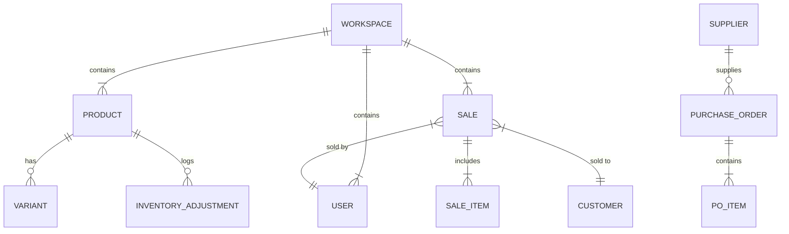
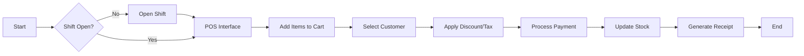

# IMS & POS System

A comprehensive, local-first **Inventory Management and Point of Sale (POS)** system built with React, TypeScript, and Dexie.js. This application is designed to be offline-capable, secure via client-side encryption, and fully responsive.

---

## 🚀 Key Features

*   **Local-First Architecture:** All data is stored locally in the browser using IndexedDB (via Dexie.js).
*   **Client-Side Encryption:** Sensitive business data (profit, cost prices, customer details) is encrypted using the Web Crypto API (AES-GCM) before being saved to the database.
*   **Zero-Knowledge Auth:** The application derives encryption keys from your password. If the password is lost, data cannot be recovered without the **Recovery Key**.
*   **Offline Capable:** Works without an internet connection using Service Workers.
*   **Responsive Design:** Optimized for tablets and desktop environments.

---

## 🔄 Software Development Life Cycle (SDLC)

This project follows an **Agile and Iterative** development model.

### Methodologies Used
1.  **Agile:** The project is designed to be flexible and adaptive. Features are decoupled (e.g., Procurement is separate from POS), allowing for independent updates and maintenance.
2.  **Iterative Model:** The application was built in cycles:
    *   **Iteration 1 (MVP):** Core POS functionality, basic product management, and local storage.
    *   **Iteration 2 (Security):** Implementation of Web Crypto API for zero-knowledge encryption of sensitive fields (Cost Price, Customer Data).
    *   **Iteration 3 (Features):** Addition of Reports, Analysis, and Procurement modules.
    *   **Iteration 4 (Refinement):** UI/UX polish, Dark Mode, and performance optimizations (Virtualization/Pagination).

---

## 📐 Architecture & Design (UML)

### 1. Use Case Diagram
Roles and their interactions with the system.

```mermaid
graph TD
    User((User))
    Admin((Admin))
    Cashier((Cashier))
    
    User <|-- Admin
    User <|-- Cashier

    subgraph "POS System"
        Auth[Login / Register]
        OpenShift[Open Shift]
        CloseShift[Close Shift]
        ProcessSale[Process Sale / Return]
        ManageInv[Manage Inventory]
        ViewReports[View Reports & Analysis]
        ConfigSettings[Configure Settings]
    end

    User --> Auth
    Cashier --> OpenShift
    Cashier --> CloseShift
    Cashier --> ProcessSale
    
    Admin --> ManageInv
    Admin --> ViewReports
    Admin --> ConfigSettings
    Admin --> ProcessSale
```

### 2. Entity Relationship (Simplified)
Data structure overview.



### 3. POS Process Flow (Activity Diagram)
The lifecycle of a transaction.



---

## 📖 Application Walkthrough

### 1. Dashboard
The command center for business intelligence.
*   **KPI Cards:**
    *   **Total Sales:** Gross revenue for the selected timeframe.
    *   **Total Profit:** Net profit (Revenue - COGS). Configurable to include/exclude tax.
    *   **Total COGS:** Cost of Goods Sold.
    *   **Low Stock Items:** Real-time counter of items below their configured threshold.
*   **Visualizations:**
    *   **Sales & Profit Chart:** A responsive Line/Bar chart visualizing performance trends.
    *   **Time Filters:** Buttons to toggle views between Today, Weekly, Monthly, Yearly, and All Time.
*   **Header Actions:**
    *   **Notifications Bell:** Displays alerts for stock outs, low stock, and overdue purchase orders.

### 2. Point of Sale (POS)
The primary interface for cashiers.
*   **Shift Control:**
    *   **Modal (Start):** Prompts for opening float.
    *   **Modal (End):** Reconciles expected cash vs. actual cash and logs variance.
*   **Left Panel (Catalog & Returns):**
    *   **Tabs:**
        *   **Catalog:** Grid view of products. Searchable by Name/SKU. Filterable by Category.
        *   **Returns:** Search past receipts. Allows granular selection of items to return from a specific invoice.
    *   **Pagination:** Controls for navigating large product lists.
*   **Right Panel (Cart):**
    *   **Customer Select:** Dropdown to attach a customer to the sale.
    *   **Cart Items:** List of selected products. quantity adjusters (+/-), and remove button.
    *   **Action Grid:**
        *   **Clear:** Wipes the cart.
        *   **Discount:** Modal to apply Fixed or Percentage discounts.
        *   **Hold:** Saves cart to "Held Orders" for later retrieval.
        *   **Tax:** Toggle tax or apply custom tax rates per order.
    *   **Totals Section:** Displays Subtotal, Discount, Tax, and Grand Total.
    *   **Pay Button:** Triggers the Payment Modal.

### 3. Inventory Management
Manage stock, pricing, and categorization.
*   **Tabs:**
    *   **Products:**
        *   **Data Table:** Displays SKU, Name, Categories, Stock, Prices, and Margin.
        *   **Actions:**
            *   *History:* Audit log of stock moves and price changes.
            *   *Receive:* Quick-add stock.
            *   *Adjust:* Correct stock levels with a reason code.
            *   *Edit/Delete:* Full CRUD capabilities.
        *   **Bulk Actions:** Checkbox selection allows for Bulk Deletion or Category assignment.
    *   **Categories:**
        *   **Tree View:** Manage hierarchical product categories (e.g., Electronics > Laptops).
    *   **Valuation (Admin):**
        *   **Report:** Calculates total asset value (Cost vs Retail) and potential profit for all inventory.

### 4. Procurement
Supply chain management.
*   **Tabs:**
    *   **Purchase Orders (POs):**
        *   **Create PO:** Builder interface. Select Supplier, add items manually, or use "Auto-Fill Low Stock".
        *   **List View:** Track status (Pending, Partial, Received) and total cost.
        *   **Receiving:** Interface to mark items as received, automatically increasing inventory.
    *   **Suppliers:**
        *   **Directory:** Manage supplier contact info (Email, Phone, Address).

### 5. Customers
CRM (Customer Relationship Management).
*   **Tabs:**
    *   **Personal Data:** Basic contact info table.
    *   **Valuation & Sales:**
        *   **Metrics:** Lifetime Value (Total Spent), Total Profit, Order Count.
        *   **Purchase History:** List of all receipts associated with the customer.

### 6. Users & Shifts
Security and auditing.
*   **Tabs:**
    *   **Users:**
        *   **List:** Manage staff accounts.
        *   **Permissions:** Configure granular access control for the "Cashier" role (e.g., "Can Process Returns", "Can View Reports").
    *   **Shifts:**
        *   **Audit Log:** Historical record of all opened/closed shifts, including cash variance and notes.

### 7. Reports
Historical data analysis.
*   **Sections:**
    *   **Transaction History:** Searchable list of all sales/returns.
        *   *Receipt View:* Detailed modal with print and "Save as Image" options.
    *   **Stock Levels:** Filterable report of In Stock, Low Stock, and Out of Stock items.

### 8. Analysis
Performance metrics.
*   **Top Performers:** KPI Cards for "Most Revenue", "Highest Profit", and "Most Sold" products.
*   **Data Table:** Sortable columns for Revenue, Profit, Profit Margin %, and Sell-Through Rate.

### 9. Settings
Application configuration.
*   **Sections:**
    *   **Profile:** Edit username/password.
    *   **General:** Toggle Theme (Light/Dark/System) and Zoom/Scale. Set Timezone.
    *   **Business Details:** Configure Store Name, Code, and Receipt Footer.
    *   **Currency & Payment:** Manage Currency symbols, Tax Rates, and Auto-Discount rules.
    *   **Sync Settings:** API Endpoint and Key configuration for remote backup/sync.
    *   **View Settings:** Customize pagination limits per page.
    *   **Data Management:** Import/Export (CSV), Full Backup (JSON), Encryption Recovery, and Danger Zone (Reset/Prune).

---

## 🐞 Testing & Debugging

### Testing Strategy
Since this is a frontend-heavy application relying on complex state and IndexedDB interactions, testing is primarily **Manual and Scenario-based**:
1.  **Unit Logic:** Critical calculations (Tax, Profit, Cart Totals) are verified against expected mathematical outcomes.
2.  **Integration Flows:**
    *   *Sale Flow:* Create Product -> Open Shift -> Add to Cart -> Pay -> Check Receipt -> Check Stock deduction -> Check Shift Cash update.
    *   *Return Flow:* Find Receipt -> Select Item -> Process Return -> Check Stock increment.
3.  **Cross-Browser:** Verified on Chrome, Firefox, and Safari (iOS/MacOS) to ensure IndexedDB compatibility.

### Debugging
*   **Console Logging:** Extensive logging is used in the `SyncService` and `AuthContext` to track data flow and encryption status.
*   **DevTools:**
    *   **Application Tab:** Used to inspect IndexedDB (`IMS_POS_DB`) tables directly.
    *   **Network Tab:** Monitors Service Worker caching and Sync API calls.

---

## 🛠 Technology Stack

*   **Frontend:** React 18, TypeScript, Tailwind CSS
*   **State Management:** React Context API + Custom Hooks
*   **Database:** Dexie.js (IndexedDB wrapper)
*   **Encryption:** Web Crypto API (PBKDF2 key derivation, AES-GCM encryption)
*   **Charts:** Recharts
*   **PDF/Image Generation:** html2canvas
*   **Icons:** Custom SVG Components

---

## 📖 Quick Start

1.  **Register Business:** Creates a new encrypted workspace. You will be given a **Store Code** and a **Recovery Key**. Save these immediately.
2.  **Demo Mode:** Enters a temporary guest session with seeded data. Data is wiped upon logout.
3.  **Start Shift:** Navigate to POS to open a shift.
4.  **Sell:** Add items, process payment, print receipt.

---

**License:** MIT
