# IMS & POS System

A comprehensive, local-first **Inventory Management and Point of Sale (POS)** system built with React, TypeScript, and Dexie.js. This application is designed to be offline-capable, secure via client-side encryption, and fully responsive.

---

## 🚀 Key Features

*   **Local-First Architecture:** All data is stored locally in the browser using IndexedDB (via Dexie.js).
*   **Client-Side Encryption:** Sensitive business data (profit, cost prices, customer details) is encrypted using the Web Crypto API (AES-GCM) before being saved to the database.
*   **Zero-Knowledge Auth:** The application derives encryption keys from your password. If the password is lost, data cannot be recovered without the **Recovery Key**.
*   **Offline Capable:** Works without an internet connection using Service Workers.
*   **Responsive Design:** Optimized for tablets and desktop environments.

---

## 🛠 Technology Stack

*   **Frontend:** React 18, TypeScript, Tailwind CSS
*   **State Management:** React Context API + Custom Hooks
*   **Database:** Dexie.js (IndexedDB wrapper)
*   **Encryption:** Web Crypto API (PBKDF2 key derivation, AES-GCM encryption)
*   **Charts:** Recharts
*   **PDF/Image Generation:** html2canvas
*   **Icons:** Custom SVG Components

---

## 💻 Installation & Setup

To run this application locally in a development environment:

### Prerequisites
*   Node.js (v16 or higher)
*   npm or yarn

### Steps

1.  **Clone the repository:**
    ```bash
    git clone https://github.com/your-username/ims-pos-system.git
    cd ims-pos-system
    ```

2.  **Install dependencies:**
    ```bash
    npm install
    # or
    yarn install
    ```

3.  **Start the development server:**
    ```bash
    npm start
    # or
    yarn start
    ```

4.  **Open in Browser:**
    The application will launch automatically at `http://localhost:3000`.

### Building for Production
To create an optimized build for deployment:
```bash
npm run build
```
The output will be in the `build/` folder, ready to be served by any static file server (Nginx, Apache, Vercel, Netlify).

---

## 🔐 Access & Authentication

This system uses a **Zero-Knowledge** authentication model. Unlike traditional web apps, we do not store your password on a server to unlock your data. Your password *is* the key to your data.

### 1. Business Registration
When you create a business, the system performs the following cryptographic operations locally in your browser:
1.  Generates a unique **Store Code** (e.g., `WS-A1B2C3`).
2.  Generates a random **Data Encryption Key (DEK)** (AES-GCM 256-bit).
3.  Derives a **Key Encryption Key (KEK)** from your password using **PBKDF2**.
4.  Encrypts (wraps) the DEK using the KEK and stores the wrapped key.
5.  Exports the raw DEK as a **Recovery Key**.
6.  **NOTE:** We do NOT store your password or even a hash of it for authentication.

### 2. Login (Cryptographic Challenge)
To log in, you need:
*   **Store Code** (or Email, if unique)
*   **Username**
*   **Password**

The system attempts to unlock (decrypt) your Data Key using the password provided.
*   If the key unwraps successfully: The password is correct, and the database is unlocked.
*   If the operation fails: The password is incorrect.

### 3. Forgot Password / Account Recovery
Because we cannot see your password, we cannot send you a "reset link".
1.  Go to the Login screen.
2.  Click **"Forgot Password?"**.
3.  Enter your Email and the **Recovery Key** you saved during registration.
4.  The system validates the key against a stored fingerprint (KCV).
5.  Enter a new password. The system uses the Recovery Key to re-encrypt the master key with your *new* password.

### 4. Demo Mode
*   **Purpose:** To explore the application features without setting up an account.
*   **Data:** Pre-seeded with sample products, suppliers, and customers.
*   **Persistence:** Data is stored in a temporary "Guest Workspace" in your browser. **All data is permanently wiped upon logout.**
*   **Security:** Encryption is disabled or uses ephemeral keys in Demo Mode.

---

## 📖 Application Walkthrough

The application is divided into several modules, accessible via the sidebar navigation.

### 1. Dashboard
The command center of your business.
*   **Overview Cards:** Real-time metrics for Total Sales, Total Profit (encrypted field), Cost of Goods Sold (COGS), and Low Stock alerts.
*   **Sales Chart:** Interactive line/bar chart displaying Sales vs. Profit trends over different time ranges (Today, Weekly, Monthly, Yearly).
*   **Notifications Panel:** Alerts for low stock, overdue purchase orders, and system messages.

### 2. Point of Sale (POS)
A robust interface for processing transactions.
*   **Register Tab:**
    *   **Catalog:** Browse products with search and category filters. Click to add to cart.
    *   **Cart:** Adjust quantities, remove items, apply discounts (fixed/percent), and apply taxes.
    *   **Hold Order:** Park a current sale to retrieve later.
    *   **Shift Management:** Open and close shifts with cash float tracking and reconciliation.
    *   **Payment:** Supports split payments across Cash, Card, and Other methods.
*   **Returns Tab:** Lookup past receipts by ID to process full or partial returns. Stock is automatically adjusted.

### 3. Inventory Management
*   **Products:** Comprehensive CRUD for products. Supports Variants (e.g., Size/Color), SKU management, and detailed Price/Stock history.
*   **Categories:** hierarchical category management (Category Tree).
*   **Valuation:** (Admin Only) A report showing total asset value (Cost vs Retail) and potential profit for current inventory.

### 4. Procurement
*   **Purchase Orders (POs):** Create orders for suppliers.
    *   **Auto-Fill:** Automatically populate PO with low-stock items.
    *   **Receiving:** Receive items against a PO to automatically update stock levels.
*   **Suppliers:** Manage supplier contact details.

### 5. Customers
*   **Directory:** Manage customer profiles (Name, Phone, Email, Address).
*   **Valuation:** View customer lifetime value, total spent, profit generated, and purchase history.

### 6. User Management
*   **Users:** Add/Edit staff accounts. Assign roles (Admin vs Cashier).
*   **Permissions:** Granular control over Cashier capabilities (e.g., restrict view of reports, profit margins, or ability to delete items).
*   **Shifts:** View historical shift reports, cash discrepancies, and notes.

### 7. Reports
*   **Transaction History:** Detailed list of all Sales and Returns. Filter by date, status, or salesperson.
*   **Stock Levels:** Current stock status report (In Stock, Low Stock, Out of Stock).

### 8. Analysis
*   **Performance Metrics:** View top-performing products by Revenue, Profit, or Units Sold.
*   **Sell-Through Rate:** Analyze inventory efficiency.

### 9. Settings
*   **Profile:** Update username/password.
*   **General:** Theme (Light/Dark), Zoom Level, Timezone configuration.
*   **Business Details:** Configure Store Name, Code, Address, and Receipt Footer.
*   **Currency & Tax:** Customize currency symbol/code, formatting, tax rates, and profit calculation logic.
*   **Data Management:**
    *   **Backup/Restore:** Export full workspace data as JSON.
    *   **Import/Export:** CSV support for Products and Sales.
    *   **Security:** View/Repair Recovery Keys.
    *   **Danger Zone:** Prune old data or Factory Reset.

---

## 🛡️ Encryption & Security

We utilize the **Web Crypto API** to ensure military-grade security for your sensitive business data directly in the browser.

### Encryption Standards
*   **Algorithm:** AES-GCM (Advanced Encryption Standard - Galois/Counter Mode) with 256-bit keys.
*   **Key Derivation:** PBKDF2 (Password-Based Key Derivation Function 2) with high iteration counts and random salts.
*   **Zero Storage:** Passwords are never stored. Authentication is purely a cryptographic challenge.

### Encrypted Fields
*   **Products:** Cost Price (hides margins from cashiers).
*   **Sales:** Profit, COGS, Total, Subtotal, Tax, Discount.
*   **Customers:** Phone, Email, Address, Notes (PII protection).
*   **Suppliers:** Contact details.
*   **Shifts:** Cash counts and discrepancies.

### Durability & Safety
*   **Data Isolation:** Each workspace has a unique ID (`workspaceId`) and unique encryption keys. Data from one business cannot be read by another, even if they share the same browser.
*   **Zero-Knowledge:** Since the encryption key is derived from your password client-side, even if the database file were stolen, the sensitive fields would remain unreadable ciphertext without the password or recovery key.

---

## 🧪 Testing and Debugging

Since this is a local-first application relying heavily on IndexedDB and client-side logic, testing approaches focus on browser capabilities.

### Manual Testing
1.  **Auth Flow:** Test registration, logout, and login with incorrect passwords to verify crypto challenges.
2.  **Offline Mode:** Open DevTools > Network > select "Offline". Verify navigation and data access continues to work via Service Worker and Dexie.
3.  **Data Persistence:** Refresh the page (F5) to ensure Redux-like state (Context) is re-hydrated correctly from IndexedDB.

### Debugging Tools
*   **Application Tab (DevTools):** Use the "IndexedDB" section to inspect the `IMS_POS_DB`. You will see tables like `products` and `sales`. Note that sensitive fields will appear as `__ENC__:...` strings.
*   **Console:** The application logs critical crypto failures and sync events.
*   **Emergency Key Repair:** If data appears corrupted (decryption fails due to key mismatch), use the "Repair Access" tool in Settings > Data Management to re-inject the raw Recovery Key.

---

## 📐 Architecture & Diagrams (UML)

The following diagrams illustrate the structure, behavior, and interactions within the system.

### 1. Architectural Diagram (C4 Level 2 - Container)
High-level overview of the application container within the browser context.

```mermaid
graph TB
    User((User))
    
    subgraph "Browser / Client Device"
        subgraph "React Application"
            UI[UI Components]
            Context[React Context Providers]
            Services["Service Logic (Sync, Crypto)"]
        end
        
        DB[(IndexedDB / Dexie.js)]
        LocalKey[Memory / Crypto Key]
    end
    
    API[External Sync API (Optional)]

    User --> UI
    UI --> Context
    Context --> Services
    Services --> DB
    Services --> LocalKey
    Services -.-> API
    
    LocalKey -.->|Encrypts/Decrypts| DB
```

### 2. Context Diagram
System boundary definition.

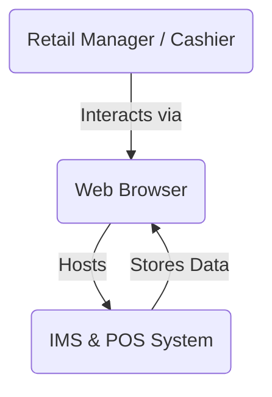

### 3. Use Case Diagram
Roles and their authorized interactions.

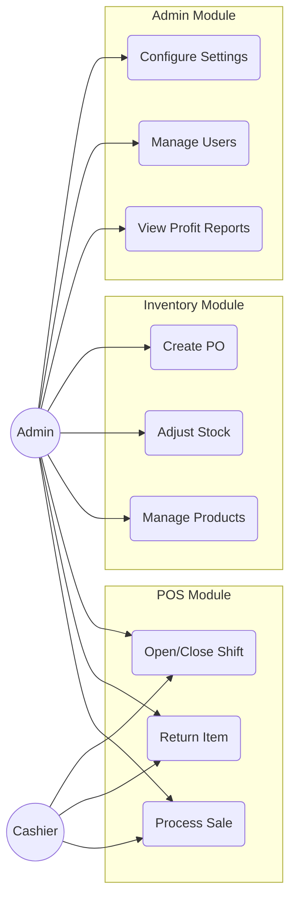

### 4. Class Diagram
Core domain entities.

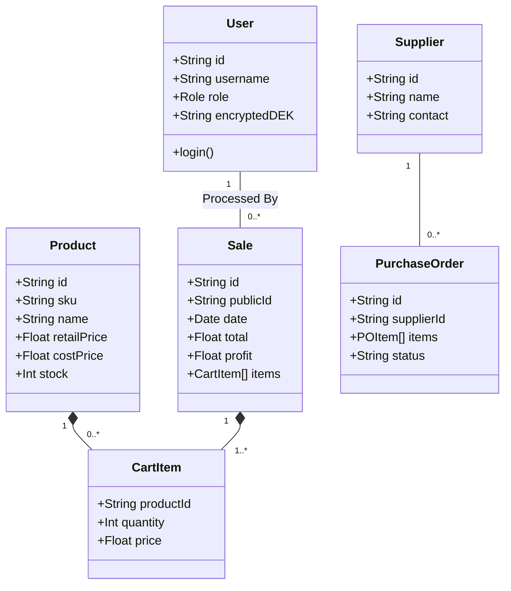

### 5. Component Diagram
React component structure.

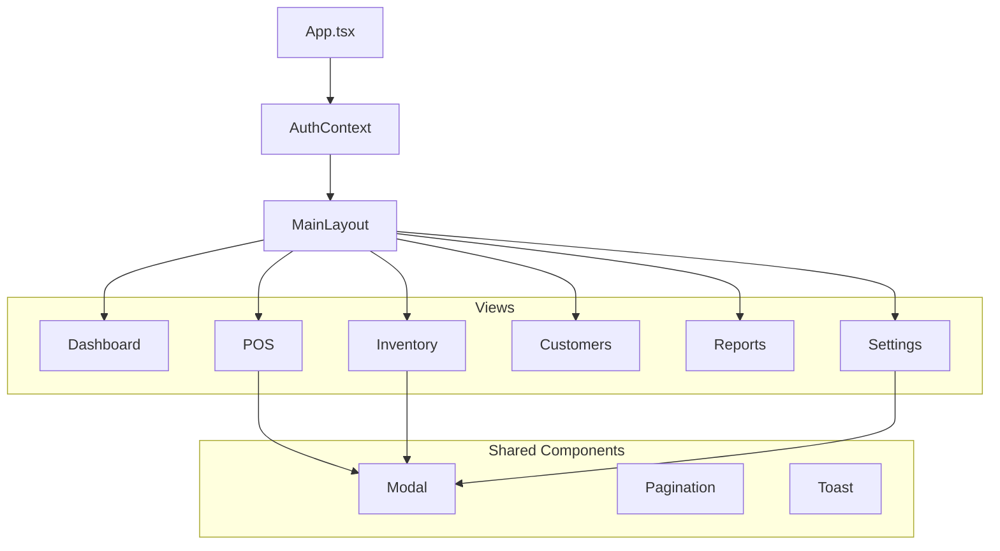

### 6. Deployment Diagram
Physical deployment architecture.

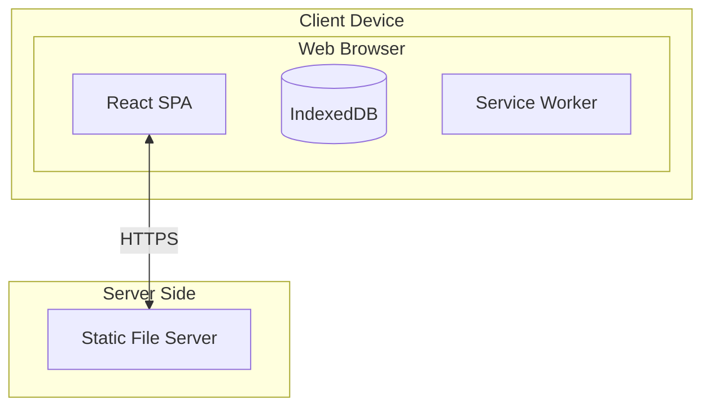

### 7. Entity-Relationship Diagram (ERD)
Database schema relationships.

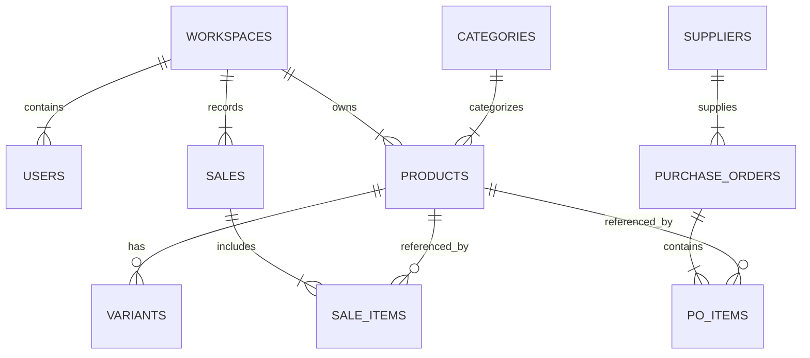

### 8. Data Flow Diagram (DFD) - Level 1
Data flow for adding a sale.

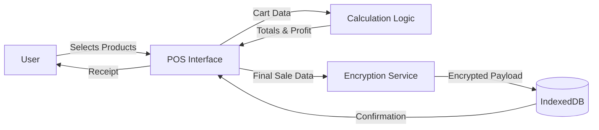

### 9. Sequence Diagram
Flow of a successful login event.

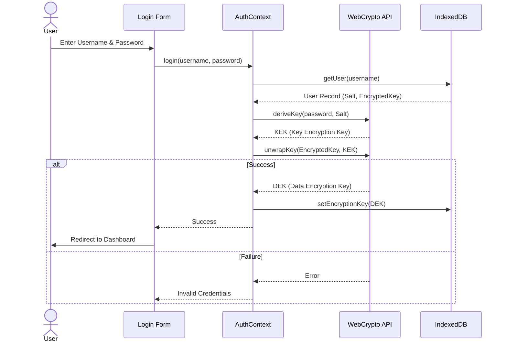

### 10. Activity Diagram
Inventory Adjustment Workflow.

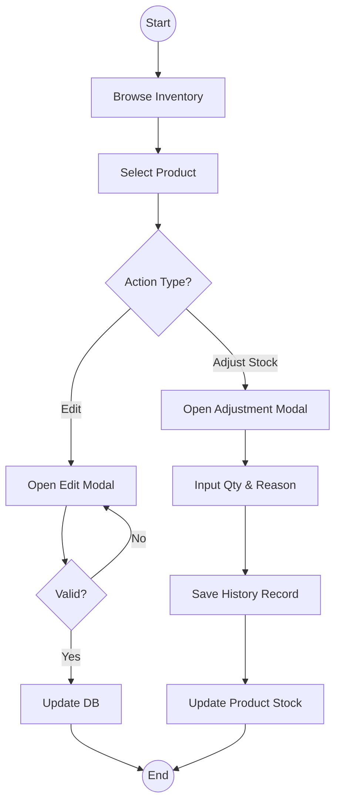

### 11. State Machine Diagram
Lifecycle of a Purchase Order.

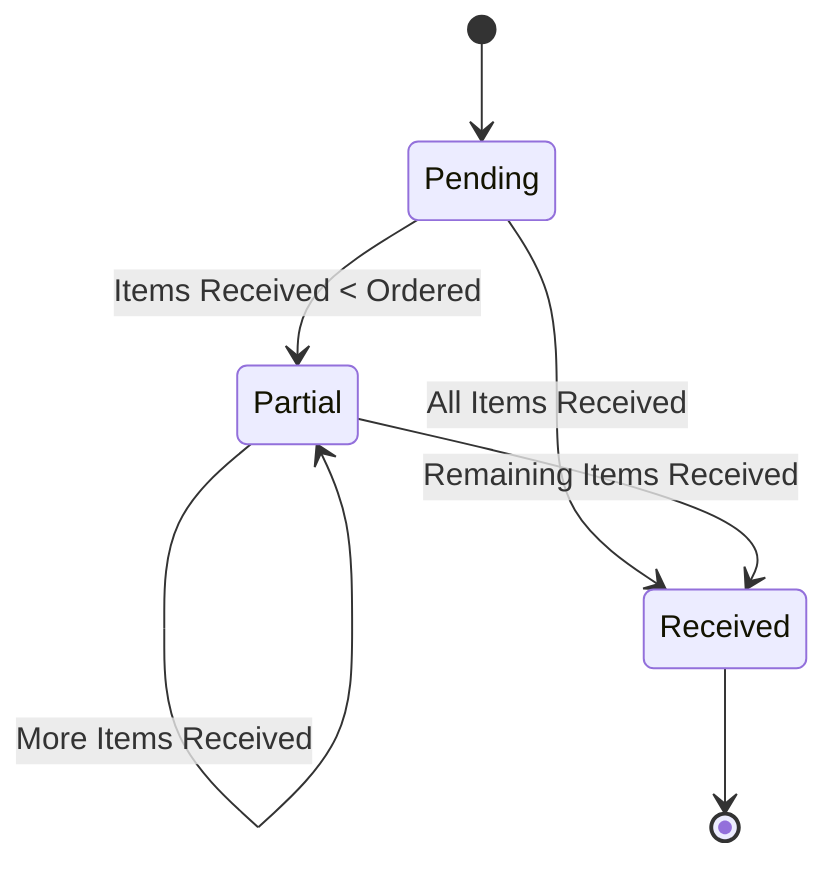

### 12. Flowchart
Application Initialization and Auth Check.

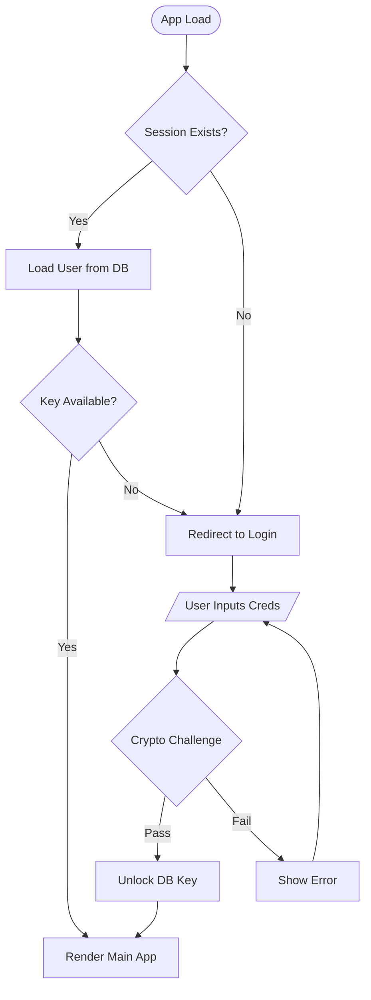

---

## 🔄 Software Development Life Cycle (SDLC)

This project follows an **Agile and Iterative** development model.

### Methodologies Used
1.  **Agile:** The project is designed to be flexible and adaptive. Features are decoupled (e.g., Procurement is separate from POS), allowing for independent updates and maintenance.
2.  **Iterative Model:** The application was built in cycles:
    *   **Iteration 1 (MVP):** Core POS functionality, basic product management, and local storage.
    *   **Iteration 2 (Security):** Implementation of Web Crypto API for zero-knowledge encryption of sensitive fields (Cost Price, Customer Data).
    *   **Iteration 3 (Features):** Addition of Reports, Analysis, and Procurement modules.
    *   **Iteration 4 (Refinement):** UI/UX polish, Dark Mode, and performance optimizations (Virtualization/Pagination).

---

## 🔧 Troubleshooting

### 1. "Decryption Failed" or Garbled Text
If you see random characters (e.g., `__ENC__:...`) instead of prices or names:
*   **Cause:** The encryption key in memory does not match the key used to encrypt the data. This often happens if a password reset was performed incorrectly or browser storage was partially cleared.
*   **Fix:**
    1.  Go to **Settings > Encryption & Recovery**.
    2.  Click **Emergency Key Repair**.
    3.  Enter your **Recovery Key** and your **Current Password**.
    4.  This forces the system to re-wrap the data key, restoring access.

### 2. Application Sluggishness
If the app feels slow after months of use:
*   **Cause:** Accumulation of thousands of transaction records in IndexedDB.
*   **Fix:**
    1.  Go to **Settings > Data Management**.
    2.  Open the **Danger Zone**.
    3.  Select **Prune Old Data**.
    4.  Choose a target (e.g., "Sales") and a timeframe (e.g., "Older than 90 days"). This deletes old records to free up memory.

### 3. Data Not Saving
*   **Check:** Ensure you are not in **Demo Mode**. Demo mode does not persist data after you close the session.
*   **Check:** Ensure your browser has disk space available. IndexedDB allows large storage, but the OS may restrict it if the disk is full.

---

**License:** MIT
