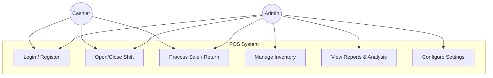
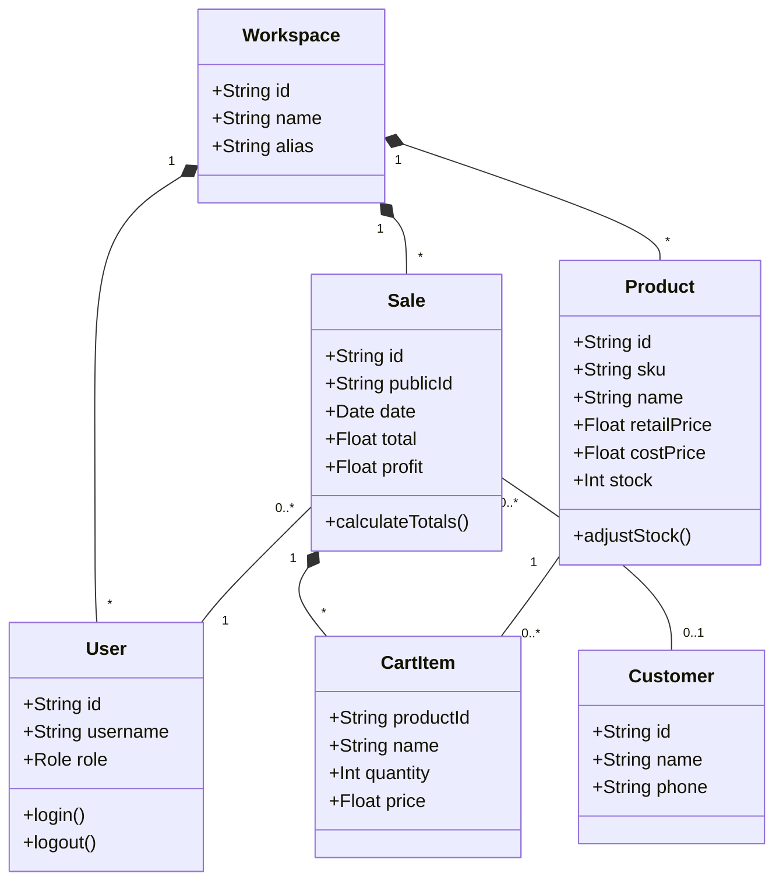

# IMS & POS System

A comprehensive, local-first **Inventory Management and Point of Sale (POS)** system built with React, TypeScript, and Dexie.js. This application is designed to be offline-capable, secure via client-side encryption, and fully responsive.

---

## 🚀 Key Features

*   **Local-First Architecture:** All data is stored locally in the browser using IndexedDB (via Dexie.js).
*   **Client-Side Encryption:** Sensitive business data (profit, cost prices, customer details) is encrypted using the Web Crypto API (AES-GCM) before being saved to the database.
*   **Zero-Knowledge Auth:** The application derives encryption keys from your password. If the password is lost, data cannot be recovered without the **Recovery Key**.
*   **Offline Capable:** Works without an internet connection using Service Workers.
*   **Responsive Design:** Optimized for tablets and desktop environments.

---

## 🔐 Access & Authentication

This system uses a **Zero-Knowledge** authentication model. Unlike traditional web apps, we do not store your password on a server to unlock your data. Your password *is* the key to your data.

### 1. Business Registration
When you create a business, the system performs the following cryptographic operations locally in your browser:
1.  Generates a unique **Store Code** (e.g., `WS-A1B2C3`).
2.  Generates a random **Data Encryption Key (DEK)** (AES-GCM 256-bit).
3.  Derives a **Key Encryption Key (KEK)** from your password using **PBKDF2**.
4.  Encrypts (wraps) the DEK using the KEK and stores the wrapped key.
5.  Exports the raw DEK as a **Recovery Key**.

**Important:** You MUST save your **Store Code** and **Recovery Key**. If you forget your password, the Recovery Key is the *only* way to restore access to your encrypted data.

### 2. Login
To log in, you need:
*   **Store Code** (or Email, if unique)
*   **Username**
*   **Password**

The system attempts to decrypt your Data Key using the password provided. If successful, the database unlocks.

### 3. Forgot Password / Account Recovery
Because we cannot see your password, we cannot send you a "reset link".
1.  Go to the Login screen.
2.  Click **"Forgot Password?"**.
3.  Enter your Email and the **Recovery Key** you saved during registration.
4.  Enter a new password.
5.  The system uses the Recovery Key to decrypt the database and re-encrypts the master key with your *new* password.

### 4. Demo Mode
*   **Purpose:** To explore the application features without setting up an account.
*   **Data:** Pre-seeded with sample products, suppliers, and customers.
*   **Persistence:** Data is stored in a temporary "Guest Workspace" in your browser. **All data is permanently wiped upon logout.**
*   **Security:** Encryption is disabled or uses ephemeral keys in Demo Mode.

---

## 🛡️ Encryption & Security

We utilize the **Web Crypto API** to ensure military-grade security for your sensitive business data directly in the browser.

### Encryption Standards
*   **Algorithm:** AES-GCM (Advanced Encryption Standard - Galois/Counter Mode) with 256-bit keys.
*   **Key Derivation:** PBKDF2 (Password-Based Key Derivation Function 2) with high iteration counts and random salts to prevent rainbow table attacks.
*   **Encrypted Fields:**
    *   **Products:** Cost Price (hides margins from cashiers).
    *   **Sales:** Profit, COGS, Total, Subtotal, Tax, Discount.
    *   **Customers:** Phone, Email, Address, Notes (PII protection).
    *   **Suppliers:** Contact details.
    *   **Shifts:** Cash counts and discrepancies.

### Durability & Safety
*   **Data Isolation:** Each workspace has a unique ID (`workspaceId`) and unique encryption keys. Data from one business cannot be read by another, even if they share the same browser.
*   **Zero-Knowledge:** Since the encryption key is derived from your password client-side, even if the database file were stolen, the sensitive fields would remain unreadable ciphertext without the password or recovery key.

---

## 🔧 Troubleshooting

### 1. "Decryption Failed" or Garbled Text
If you see random characters (e.g., `__ENC__:...`) instead of prices or names:
*   **Cause:** The encryption key in memory does not match the key used to encrypt the data. This often happens if a password reset was performed incorrectly or browser storage was partially cleared.
*   **Fix:**
    1.  Go to **Settings > Encryption & Recovery**.
    2.  Click **Emergency Key Repair**.
    3.  Enter your **Recovery Key** and your **Current Password**.
    4.  This forces the system to re-wrap the data key, restoring access.

### 2. Application Sluggishness
If the app feels slow after months of use:
*   **Cause:** Accumulation of thousands of transaction records in IndexedDB.
*   **Fix:**
    1.  Go to **Settings > Data Management**.
    2.  Open the **Danger Zone**.
    3.  Select **Prune Old Data**.
    4.  Choose a target (e.g., "Sales") and a timeframe (e.g., "Older than 90 days"). This deletes old records to free up memory.

### 3. Data Not Saving
*   **Check:** Ensure you are not in **Demo Mode**. Demo mode does not persist data after you close the session.
*   **Check:** Ensure your browser has disk space available. IndexedDB allows large storage, but the OS may restrict it if the disk is full.

---

## 🔄 Software Development Life Cycle (SDLC)

This project follows an **Agile and Iterative** development model.

### Methodologies Used
1.  **Agile:** The project is designed to be flexible and adaptive. Features are decoupled (e.g., Procurement is separate from POS), allowing for independent updates and maintenance.
2.  **Iterative Model:** The application was built in cycles:
    *   **Iteration 1 (MVP):** Core POS functionality, basic product management, and local storage.
    *   **Iteration 2 (Security):** Implementation of Web Crypto API for zero-knowledge encryption of sensitive fields (Cost Price, Customer Data).
    *   **Iteration 3 (Features):** Addition of Reports, Analysis, and Procurement modules.
    *   **Iteration 4 (Refinement):** UI/UX polish, Dark Mode, and performance optimizations (Virtualization/Pagination).

---

## 📐 Architecture & Design (UML)

### 1. Use Case Diagram
Roles and their interactions with the system.



### 2. Class Diagram
Core domain model structure.



---

## 📖 Application Walkthrough

### 1. Dashboard
The command center for business intelligence.
*   **KPI Cards:** Total Sales, Total Profit (Configurable), COGS, Low Stock Items.
*   **Visualizations:** Sales & Profit Chart (Line/Bar).
*   **Time Filters:** Today, Weekly, Monthly, Yearly, All Time.

### 2. Point of Sale (POS)
The primary interface for cashiers.
*   **Shift Control:** Start/End shift with float reconciliation.
*   **Catalog & Returns:** Searchable product grid and receipt lookup for returns.
*   **Cart Features:** Customer association, Discounts (Fixed/%), Tax toggles, Held Orders.

### 3. Inventory Management
*   **Products:** CRUD operations, Variant support, Stock Adjustments, Receiving.
*   **Categories:** Hierarchical category tree.
*   **Valuation:** Real-time asset value and potential profit reports.

### 4. Procurement
*   **Purchase Orders:** Create POs from suppliers, auto-fill low stock items.
*   **Receiving:** One-click receive to update inventory.
*   **Suppliers:** Manage vendor contact details.

### 5. Customers
*   **CRM:** Track purchase history, total spend, and contact info.
*   **Metrics:** Lifetime Value and Profitability analysis per customer.

### 6. Settings
*   **General:** Theme (Dark/Light), Timezone, Zoom.
*   **Business:** Store details for receipts.
*   **Security:** Key Management, Permissions.
*   **Data:** Import/Export (CSV), Backup/Restore (JSON), Danger Zone.

---

## 💻 Installation & Setup

To run this application locally in a development environment:

### Prerequisites
*   Node.js (v16 or higher)
*   npm or yarn

### Steps

1.  **Clone the repository:**
    ```bash
    git clone https://github.com/your-username/ims-pos-system.git
    cd ims-pos-system
    ```

2.  **Install dependencies:**
    ```bash
    npm install
    # or
    yarn install
    ```

3.  **Start the development server:**
    ```bash
    npm start
    # or
    yarn start
    ```

4.  **Open in Browser:**
    The application will launch automatically at `http://localhost:3000`.

### Building for Production
To create an optimized build for deployment:
```bash
npm run build
```
The output will be in the `build/` folder, ready to be served by any static file server (Nginx, Apache, Vercel, Netlify).

---

## 🛠 Technology Stack

*   **Frontend:** React 18, TypeScript, Tailwind CSS
*   **State Management:** React Context API + Custom Hooks
*   **Database:** Dexie.js (IndexedDB wrapper)
*   **Encryption:** Web Crypto API (PBKDF2 key derivation, AES-GCM encryption)
*   **Charts:** Recharts
*   **PDF/Image Generation:** html2canvas
*   **Icons:** Custom SVG Components

---

**License:** MIT
