# Architecture & Diagrams (UML)

The following diagrams illustrate the structure, behavior, and interactions within the system.

### 1. Architectural Diagram (C4 Level 2 - Container)
High-level overview of the application container within the browser context.

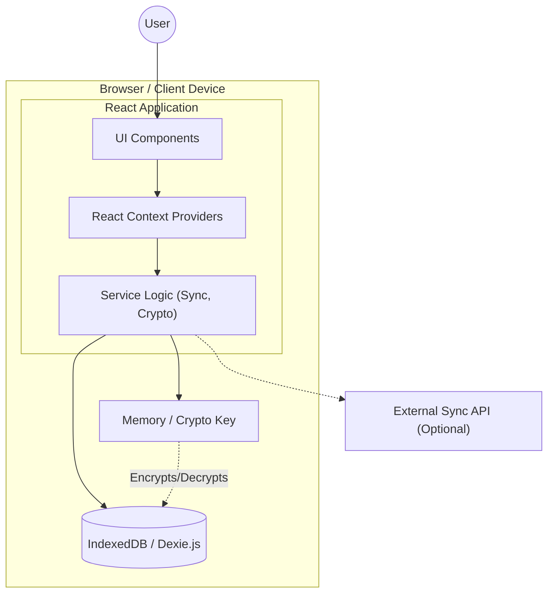

### 2. Context Diagram
System boundary definition.

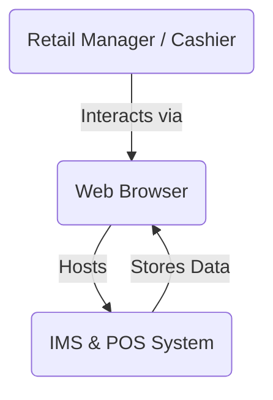

### 3. Use Case Diagram
Roles and their authorized interactions.

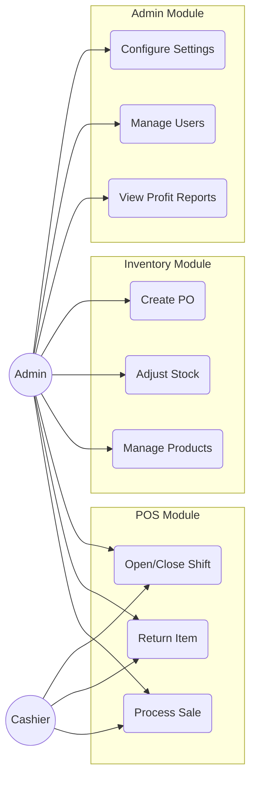

### 4. Class Diagram
Core domain entities.

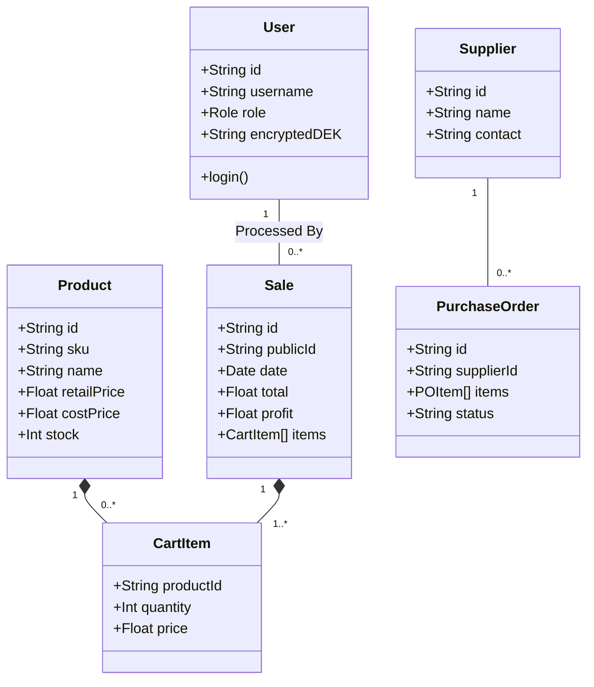

### 5. Component Diagram
React component structure.

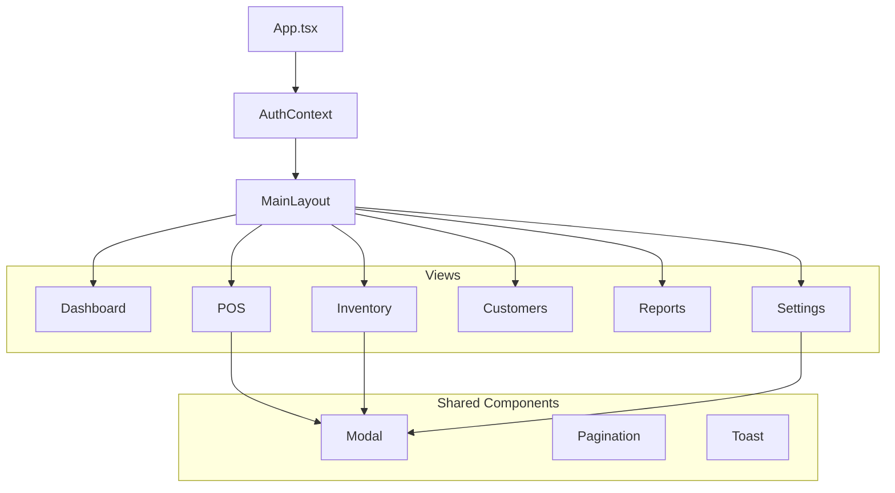

### 6. Deployment Diagram
Physical deployment architecture.

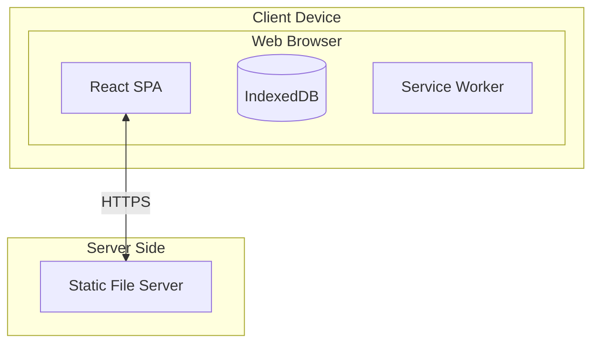

### 7. Entity-Relationship Diagram (ERD)
Database schema relationships.

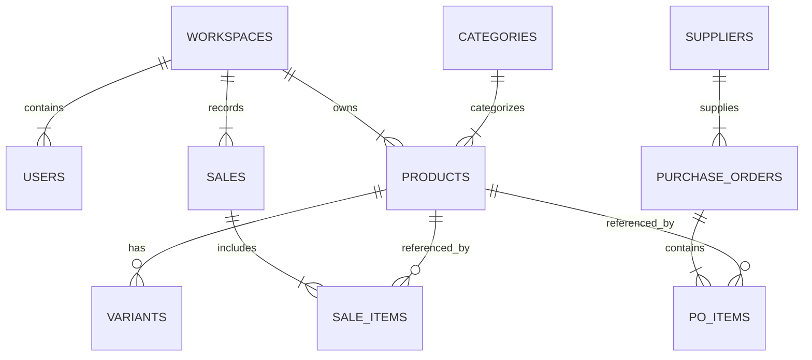

### 8. Data Flow Diagram (DFD) - Level 1
Data flow for adding a sale.

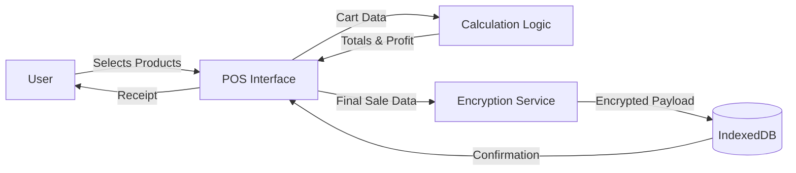

### 9. Sequence Diagram
Flow of a successful login event.

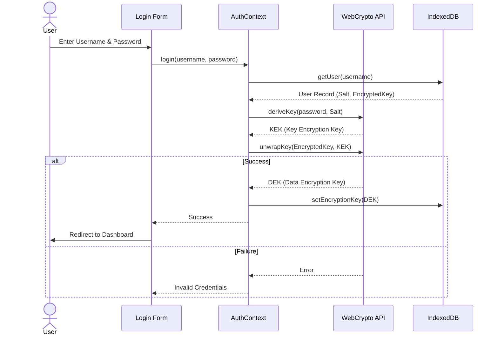

### 10. Activity Diagram
Inventory Adjustment Workflow.

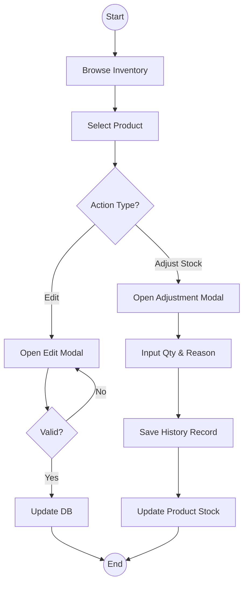

### 11. State Machine Diagram
Lifecycle of a Purchase Order.

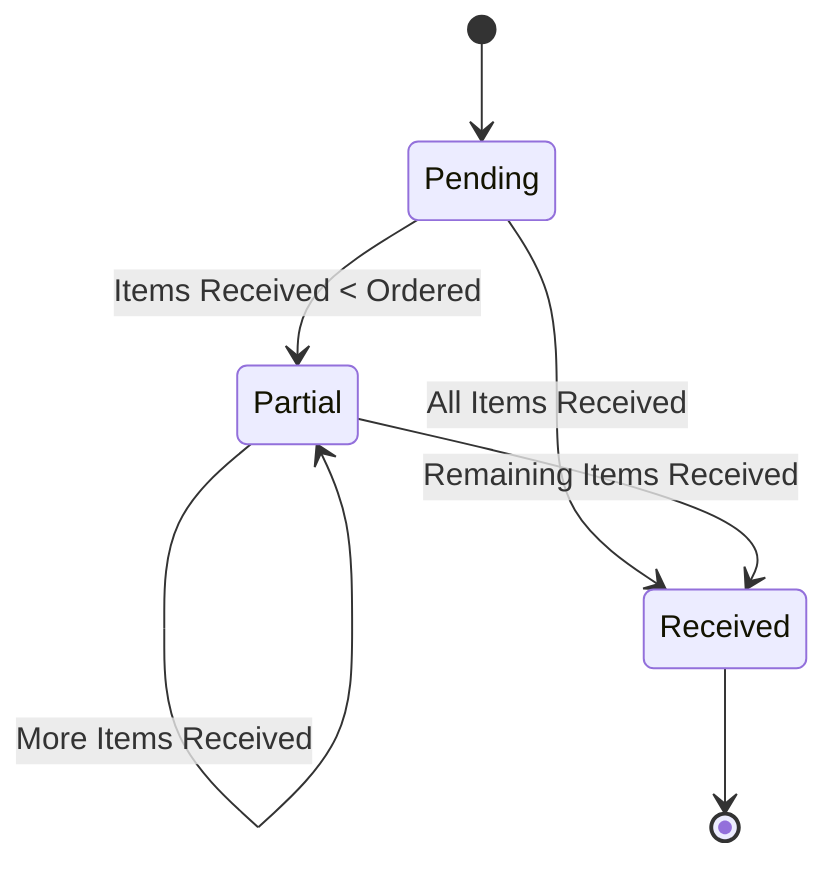

### 12. Flowchart
Application Initialization and Auth Check.

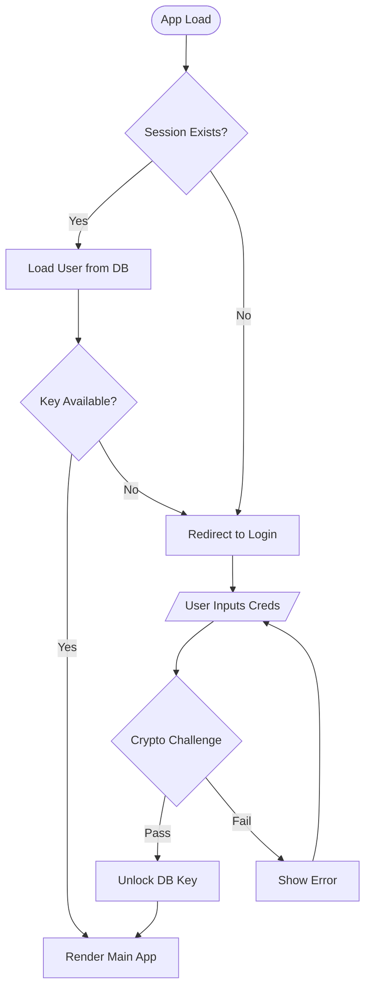
